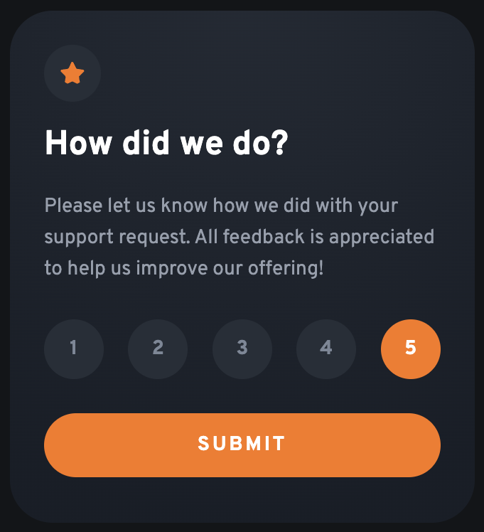

# Frontend Mentor - Interactive rating component solution

This is a solution to the [Interactive rating component challenge on Frontend Mentor](https://www.frontendmentor.io/challenges/interactive-rating-component-koxpeBUmI). Frontend Mentor challenges help you improve your coding skills by building realistic projects.

## Table of contents

- [Overview](#overview)
  - [The challenge](#the-challenge)
  - [Screenshot](#screenshot)
  - [Links](#links)
- [My process](#my-process)
  - [Built with](#built-with)
  - [What I learned](#what-i-learned)
  - [Continued development](#continued-development)
  - [Useful resources](#useful-resources)
- [Author](#author)

## Overview

### The challenge

Users should be able to:

- View the optimal layout for the app depending on their device's screen size
- See hover states for all interactive elements on the page
- Select and submit a number rating
- See the "Thank you" card state after submitting a rating

### Screenshot




### Links

- Live Site URL: [https://6600bffd622a35488b3fc6dc--celebrated-sable-c7c0f1.netlify.app/]

## My process

### Built with

- Semantic HTML5 markup
- CSS custom properties
- Flexbox
- Mobile-first workflow
- [React](https://reactjs.org/) - JS library

### What I learned

- React components are functional JavaScript units used to build user interfaces.
- State management in React involves using hooks like useState to keep track of component data.
- Event handling in React allows components to respond to user interactions like clicks or input changes.
- JSX syntax blends HTML structure with JavaScript code for defining UI elements within components.
- Conditional rendering in React allows components to display different UI elements based on certain conditions.

```jsx
const [rating, setRating] = useState(0);
const [isRated, setIsRated] = useState(false);

const handleSelectRating = (value) => {
  setRating(value);
};

const handleSubmit = () => {
  if (rating) setIsRated(true);
};

<main className="app">
  {!isRated ? (
    <Rating onSelectRating={handleSelectRating} onHandleSubmit={handleSubmit} />
  ) : (
    <Confirmation rating={rating} />
  )}
</main>;
```

### Continued development

I plan to delve deeper into React basics by exploring more about state management and component lifecycle. Understanding how to efficiently manage state within components and grasp the lifecycle methods will enhance my ability to build more complex and interactive applications.

Additionally, I aim to practice conditional rendering techniques further to create more dynamic user interfaces. Alongside this, I intend to strengthen my understanding of React's event handling mechanisms to develop more responsive applications.

Engaging in hands-on coding exercises and experimenting with different React features will be instrumental in solidifying my understanding of these fundamental concepts. Furthermore, I will continue to explore resources such as tutorials, documentation, and online courses to expand my knowledge and proficiency in React development.

Through consistent practice and exploration, I aim to become more confident and skilled in leveraging React to build modern web applications.

### Useful resources

- [https://react.dev/](https://www.example.com) - React docs

## Author

- Frontend Mentor - [@jake4369](https://www.frontendmentor.io/profile/jake4369)
- Twitter - [@jakexcode](https://www.twitter.com/jakexcode)
