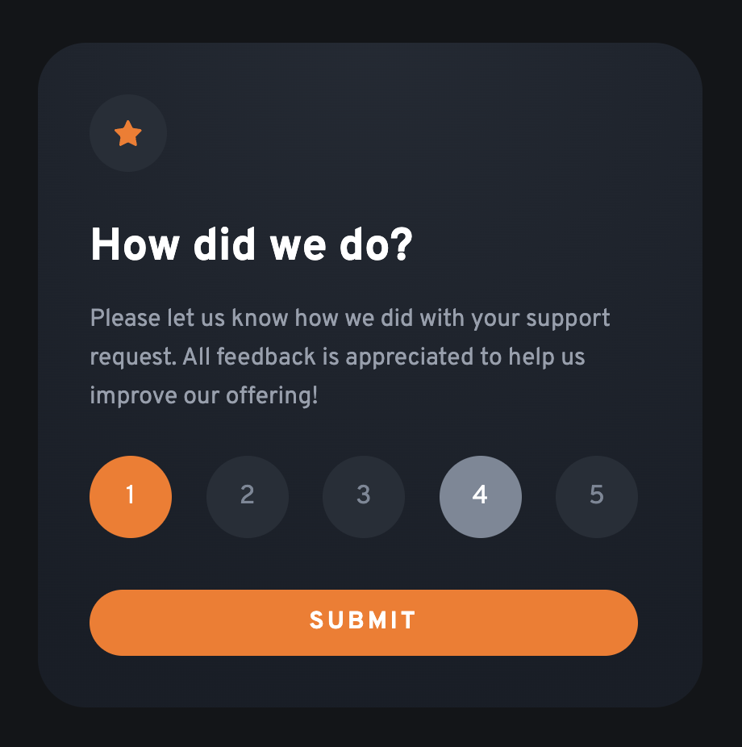

# Frontend Mentor - Interactive rating component solution

This is a solution to the [Interactive rating component challenge on Frontend Mentor](https://www.frontendmentor.io/challenges/interactive-rating-component-koxpeBUmI). Frontend Mentor challenges help you improve your coding skills by building realistic projects.

## Table of contents

- [Overview](#overview)
  - [The challenge](#the-challenge)
  - [Screenshot](#screenshot)
  - [Links](#links)
- [My process](#my-process)
  - [Built with](#built-with)
  - [What I learned](#what-i-learned)
- [Author](#author)

## Overview

### The challenge

Users should be able to:

- View the optimal layout for the app depending on their device's screen size
- See hover states for all interactive elements on the page
- Select and submit a number rating
- See the "Thank you" card state after submitting a rating

### Screenshot




### Links

- Solution URL: [https://www.frontendmentor.io/solutions/interactive-rating-component-Yz1rnvVmWM]
- Live Site URL: [https://lovely-taiyaki-49a119.netlify.app/]

## My process

### Built with

- Semantic HTML5 markup
- CSS custom properties
- Flexbox
- Mobile-first workflow

### What I learned

I learned how to use and customize radio buttons which I used for the rating components

```html
<div class="radio-toolbar" id="radio-toolbar">
  <input type="radio" id="radioOne" name="radioRating" value="1" checked />
  <label for="radioOne">1</label>

  <input type="radio" id="radioTwo" name="radioRating" value="2" />
  <label for="radioTwo">2</label>

  <input type="radio" id="radioThree" name="radioRating" value="3" />
  <label for="radioThree">3</label>

  <input type="radio" id="radioFour" name="radioRating" value="4" />
  <label for="radioFour">4</label>

  <input type="radio" id="radioFive" name="radioRating" value="5" />
  <label for="radioFive">5</label>
</div>
```

```css
.radio-toolbar {
  display: flex;
  align-items: center;
  justify-content: space-between;
  margin-bottom: 32px;
}

.radio-toolbar input[type="radio"] {
  opacity: 0;
  position: fixed;
  width: 0;
}

.radio-toolbar label {
  font-size: 14px;
  line-height: 24px;
  color: #7c8798;
  background: #262e38;
  display: flex;
  align-items: center;
  justify-content: center;
  width: 42px;
  height: 42px;
  border: none;
  border-radius: 50%;
  cursor: pointer;
  transition: all 0.3s ease-in-out;
}

.radio-toolbar label:hover {
  color: #fff;
  background: #7c8798;
}

.radio-toolbar input[type="radio"]:checked + label {
  color: #fff;
  background: #fc7614;
}
```

## Author

- Frontend Mentor - [@jake4369](https://www.frontendmentor.io/profile/jake4369)
- Twitter - [@jakexcode](https://www.twitter.com/jakexcode)
