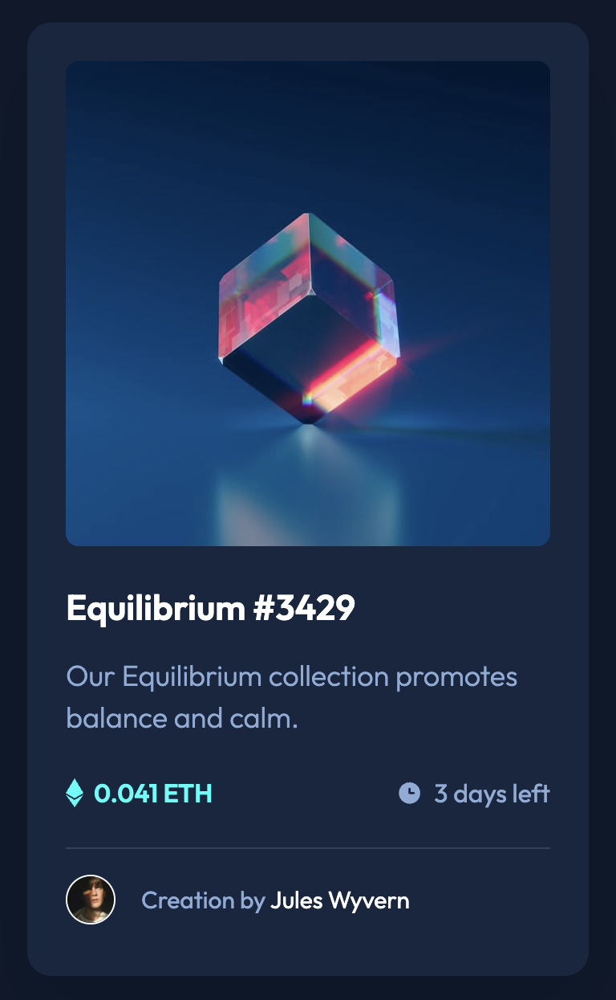

# Frontend Mentor - NFT preview card component solution

This is a solution to the [NFT preview card component challenge on Frontend Mentor](https://www.frontendmentor.io/challenges/nft-preview-card-component-SbdUL_w0U). Frontend Mentor challenges help you improve your coding skills by building realistic projects.

## Table of contents

- [Overview](#overview)
  - [The challenge](#the-challenge)
  - [Screenshot](#screenshot)
  - [Links](#links)
- [My process](#my-process)
  - [Built with](#built-with)
  - [What I learned](#what-i-learned)
  - [Useful resources](#useful-resources)
- [Author](#author)
- [Acknowledgments](#acknowledgments)

## Overview

### The challenge

Users should be able to:

- View the optimal layout depending on their device's screen size
- See hover states for interactive elements

### Screenshot



### Links

- Solution URL: [Add solution URL here](https://your-solution-url.com)
- Live Site URL: [https://66002f7e071f06dc3261aa38--gregarious-concha-2cf5d9.netlify.app/]

## My process

### Built with

- Semantic HTML5 markup
- CSS custom properties
- Flexbox
- Mobile-first workflow

### What I learned

```html
<div class="card-img">
  
  <div class="card-img__filter"></div>
</div>
```

```css
.card-img {
  position: relative; /* Establishes positioning context for child elements */
  height: 18.875rem; /* Sets the height of the container */
  overflow: hidden; /* Hides any content that exceeds the container's dimensions */
  cursor: pointer; /* Changes the cursor to a pointer when hovering over the container */
}

.card-img::before {
  content: ""; /* Generates pseudo-element content */
  position: absolute; /* Positions the pseudo-element relative to its first positioned (non-static) ancestor */
  top: 0; /* Positions the pseudo-element at the top of the container */
  left: 0; /* Positions the pseudo-element at the left of the container */
  width: 100%; /* Sets the width of the pseudo-element to match the container */
  height: 100%; /* Sets the height of the pseudo-element to match the container */
  background: var(--cyan); /* Sets the background color of the pseudo-element */
  opacity: 0; /* Sets the initial opacity of the pseudo-element to fully transparent */
  border-radius: 0.5rem; /* Applies border-radius to round the corners of the pseudo-element */
}

.card-img:hover::before {
  opacity: 0.503; /* Changes the opacity of the pseudo-element to create a hover effect */
}
```

The provided CSS was applied to a div element with the class card-img, which contains an img element and another div element with the class card-img\_\_filter. The purpose is to create a hover effect on this card-like structure.

### Useful resources

- [https://developer.mozilla.org/en-US/docs/Web/CSS/Pseudo-elements] - This is a useful site for learning more about CSS pseudo-elements which are is a keyword added to a selector that lets you style a specific part of the selected element(s).
- [https://animista.net/] - A library of awesome, easy to use CSS keyframe animations.

## Author

- Website - [Add your name here](https://www.your-site.com)
- Frontend Mentor - [@jake4369](https://www.frontendmentor.io/profile/jake4369)
- Twitter - [@jakexcode](https://www.twitter.com/jakexcode)

## Acknowledgments

[https://animista.net/] are provides of great CSS keyframe animations which I used in this project and are forever greatful for their awesome work!
